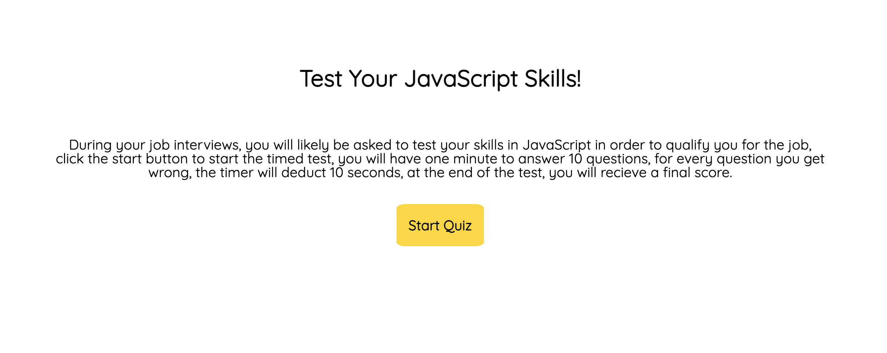
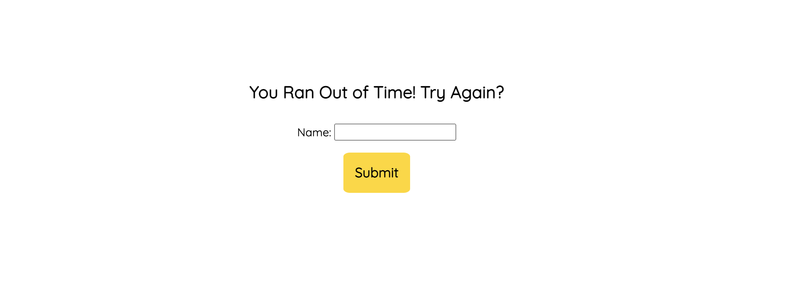
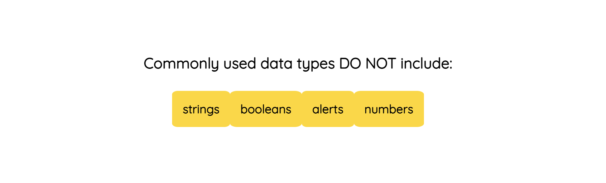

# Timed-JavaScript-Quiz

## Description

- What was your motivation?
    My motivation behind this project was to make a dynamic quiz game that would prompt the user to start a quiz which would start a timer and deduct time when they got the answer wrong. At the end of the quiz, they would be given a score based off of thier time left over and scoreboard would be made from the score and a name that the user would input.  
- Why did you build this project? )
    This project was a chance to practice and apply javascript that I learned in class. 
- What problem does it solve?
    During the build of this project, I had to solve the problem of going from a user start screen which introduced the game, to then to cycle through questions and store a value in local storage then retieve the value and apply it to my webpage.  
- What did you learn?
    I learned how to make a page dynamic by hiding parts of my HTMl and populating elements on my HTML from my Javascript, although I wasnt able to get my Javascript to populate more than the first question, I tried several approaches, I attempted a while loop as well as a forEach loop each of which were not successful. I learned how to store values into local storage. 

## Usage

The user clicks on the start button and they are then prompted with a question, at the end of the game, they submit thier name.

 
md

md

md

## Credits

I met with Kyle who tutuored me, although the tuturing session was centered around figuring out the best approach to tackle the project. 

I used the font from Google Fonts 

I got the questions array from Meg Meyers during office hours. 

# License

MIT License

Copyright (c) [year] [fullname]

Permission is hereby granted, free of charge, to any person obtaining a copy
of this software and associated documentation files (the "Software"), to deal
in the Software without restriction, including without limitation the rights
to use, copy, modify, merge, publish, distribute, sublicense, and/or sell
copies of the Software, and to permit persons to whom the Software is
furnished to do so, subject to the following conditions:

The above copyright notice and this permission notice shall be included in all
copies or substantial portions of the Software.

THE SOFTWARE IS PROVIDED "AS IS", WITHOUT WARRANTY OF ANY KIND, EXPRESS OR
IMPLIED, INCLUDING BUT NOT LIMITED TO THE WARRANTIES OF MERCHANTABILITY,
FITNESS FOR A PARTICULAR PURPOSE AND NONINFRINGEMENT. IN NO EVENT SHALL THE
AUTHORS OR COPYRIGHT HOLDERS BE LIABLE FOR ANY CLAIM, DAMAGES OR OTHER
LIABILITY, WHETHER IN AN ACTION OF CONTRACT, TORT OR OTHERWISE, ARISING FROM,
OUT OF OR IN CONNECTION WITH THE SOFTWARE OR THE USE OR OTHER DEALINGS IN THE
SOFTWARE.

---